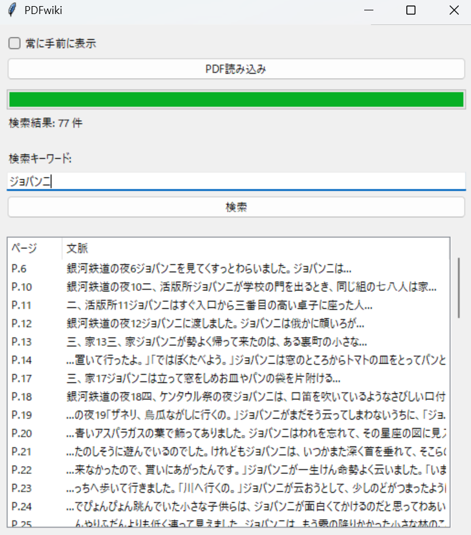

# PDFwiki

高速な検索処理を最優先とした、シンプルで軽量なデスクトップPDF検索アプリケーションです。
小説や論文など、大量のページ数を持つPDFでも、独自のインメモリ検索ロジックにより瞬時に結果を表示します。

## 主な機能
- **高速全文検索**: PDFの内容をメモリに展開し、数千ページでもストレスのない検索を実現。
- **文脈表示**: 検索ヒット箇所の前後を表示し、わざわざページを開かなくても内容を確認可能。
- **シンプルUI**: 作業の邪魔にならない縦長ウィンドウ。「常に手前に表示」機能付き。
- **ジャンプ機能**: 検索結果をダブルクリックするだけで、該当PDFを開けます。
- **軽量**: 余計な機能を削ぎ落とし、執筆や研究のお供として常駐させるのに最適です。

## インストールと実行方法

1. [Releases](https://github.com/ryojihido/PDFwiki/releases) ページから最新の `PDFwiki.exe` をダウンロードしてください。
2. `PDFwiki.exe` をダブルクリックして起動します。
3. 「PDF読み込み」ボタンから検索したいPDFファイルを選択してください。
4. 検索窓にキーワードを入力し、Enterキー（または検索ボタン）を押すと結果がリストアップされます。

## ⚠️ 「WindowsによってPCが保護されました」と表示される場合

本ソフトウェアは個人開発のフリーソフトであり、Microsoftのコード署名証明書を購入していないため、初回起動時にWindows SmartScreenの警告が表示されることがあります。
**これはウイルスではありませんのでご安心ください。**

以下の手順で起動してください：
1. ブルーの警告画面にある **「詳細情報」** というテキストリンクをクリックします。
2. 画面右下に現れる **「実行」** ボタンをクリックします。

※ 2回目以降は表示されなくなります。

## 開発環境
- Python 3.x
- PyMuPDF (High-performance PDF rendering)
- Tkinter
- Generated by Google Antigravity

## ライセンス
[GNU AGPLv3](LICENSE)
※本ソフトウェアは PyMuPDF (AGPL) を使用しているため、本ソフトウェアも AGPLv3 の下で提供されます。

Copyright (c) 2025 RyojiHido

